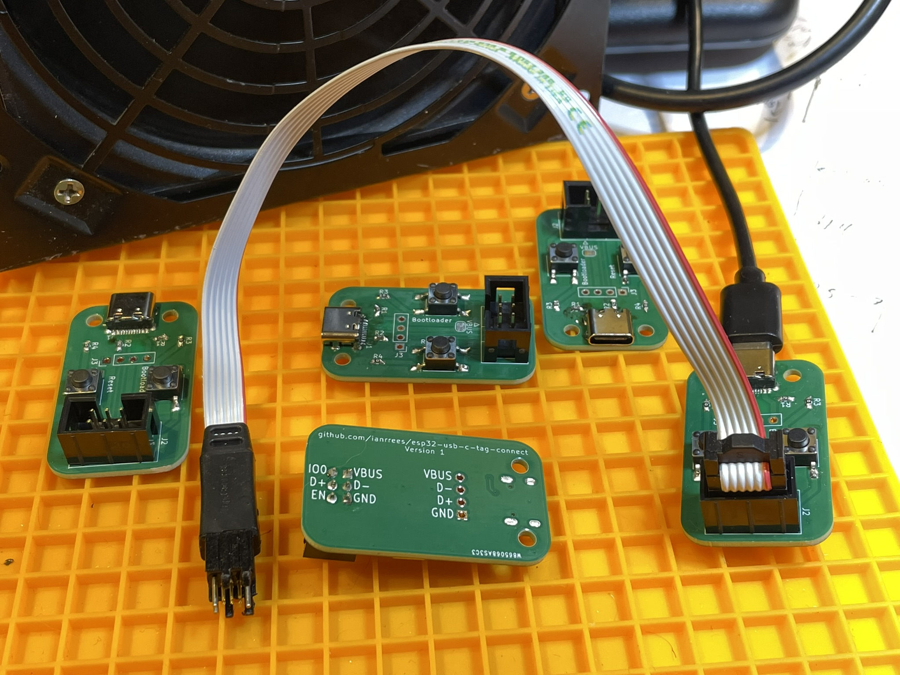

# ESP32 USB Development Tool

This board adapts USB (either a type-C socket or a cable) to a Tag Connect
TC2030-compatible footprint, for use with ESP32 such as ESP32-S3 that provide
on-chip USB JTAG and UART functionality.  The Tag Connect footprint is
compatible with the
[TC2030-USB](https://www.tag-connect.com/product/tc2030-usb), replacing the two
N/C pins in that footprint with EN and IO0, used for reset and bootloader
buttons.

## Pinouts

| J2     |      | Tag Connect header                           |
|--------|------|----------------------------------------------|
| 1      | VBUS | USB VBUS +5V                                 |
| 2      | IO0  | Hold low during reset to stay in bootloader  |
| 3      | D-   | USB data                                     |
| 4      | D+   | USB data                                     |
| 5      | GND  | Ground                                       |
| 6      | EN   | Pull low to reset the ESP32                  |

| J3 | USB cable termination |
|----|-----------------------|
| 1  | GND                   |
| 2  | D+                    |
| 3  | D-                    |
| 4  | VBUS                  |

## BOM

| Qty          | Refdes            | Description                                |
|--------------|-------------------|--------------------------------------------|
| 1            |                   | PCB - [available from PCBWay](https://www.pcbway.com/project/shareproject/USB_C_to_Tag_Connect_TC2030_for_ESP32_USB_debugging_v1_5e1c53b1.html) |
| 1 (optional) | J1                | aliexpress 16-pin USB-C connector          |
| 2            | Reset, Bootloader | aliexpress 6x6x5 SMD tactile button switch |
| 2            | R3, R4            | 0603 0 Ohm                                 |
| 2            | R1, R2            | 0603 1.5k Ohm                              |
| 1            | J2                | 2x6 0.1" box header                        |